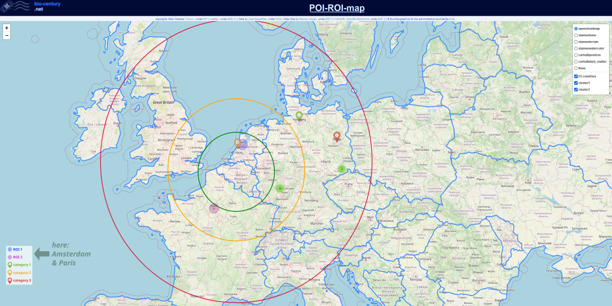

# The POI-ROI-map Project

# Abstract
Life science - an American thing? The SARS-CoV-2 pandemic has shown that European research institutions & companies are very well capable of making their contribution to the global fight for health. However, it is very easy to loose overview about which interesting life science facilities exist in Europe. The original intention of this little ROI-map project was to simplify your job search by enabling you to mark individual regions and points of interest (ROIs & POIs). Nonetheless, the script can also be used for any other purpose! A simple .xlsx spreadsheet serves you as an easy-to-access "database" and let you define the respective coordinates. Available marker elements are ROIs, distance as well as POI markers. All elements can be color-coded, the POIs can be further specified by info-popups and are automatically clustered with respect to the current zoom setting. Moreover, multiple map representations are available. Have fun to play around.<br><br>

# Table of Content
- [Installation](#Installation)
- [Getting Started](#GettingStarted)
- [Folder structure](#folderstructure)
- [Example](#Example)
- [Authors](#Authors)
- [Contributors and Acknowledgments](#ContributorsAcknowledgments)
- [Contributors / Credits to](License)
- [Sources](#Sources)
- [Contact](#Contact)


# <a id='Installation'></a> Installation
- Install Python on your local computer.
- Install following required python packages:
    - folium
    - geopandas
    - pandas
  Depending on your local setup use the pip- or the conda-commands. See requirements.txt for further specifications.
- Install an IDE of your choice


# <a id='GettingStarted'></a> Getting Started
- Download the repository
- Follow these steps:
  - Open the data.xlsx-file with a spreadsheet file editor. MS Excel works best
  - Adjust the data.xlsx-file with individual entries (optional). You can obtain the required coordinates (latitude and longitude) from google maps or from latlong.net for example
  - For new data entries: drag all computed cells down to the new line. Fill out all other required cells of the new row. Optional cells can be left blank.
    - icons
      - required fields: &nbsp;&nbsp; latitude, longitude, status, cluster
      - optional fields: &nbsp;&nbsp; name, info1, info2, info3, city, links, address
    - ROI areas
      - required fields: &nbsp;&nbsp; latitude, longitude, radius, color
      - optional fields: &nbsp;&nbsp; name
    - distance cycles
      - required fields: &nbsp;&nbsp; radius, color, starting point
      - optional fields: &nbsp;&nbsp; name
  - Open IDE of your choice and let run the program
  - Open the ROI_Map.html-file in your internet browser and take a look what you have created!
  - The legend on the right enables you to select which clusters should be depicted as well as which visualization should be used for the map


## <a id='folderstructure'></a> Folder structure
```
|   LICENSE.md                                <--- main script
|   POI-ROI-map.py
|   README.md
|   REQUIREMENTS.txt
|
+---resources
|   |   database.xlsx                         <--- main database
|   |
|   +---data
|   |       CNTR_BN_20M_2020_3035.geojson     <--- EuroGeographics dataset for depicting boundaries of European countries
|   |
|   \---images +++                            <--- all images required for HTML-headline and the map (legend)
|
\---target
        POI-ROI-map.html                      <--- target file (HTML-map) to be shown in your internet browser
```
[//]: # (tree /a /f)


## <a id='Example'></a> Example
A typical view looks like this:



## <a id='Authors'></a> Authors
bio-century.net admin


## <a id='ContributorsAcknowledgments'></a> Contributors and Acknowledgments
Many thanks to the comber.io admin for inspirations, code reviews and for initializing the bio-century.net website.


## <a id='License'></a> License
This project is published under the GNU General Public License v2.0 license. For terms and conditions see LICENSE.md<br><br>


## <a id='Sources'></a> Sources
- Technical sources:
  - <a href="https://inkscape.org/?switchlang=en/"> Inkscape </a>, under <a href="https://www.gnu.org/licenses/old-licenses/gpl-2.0.en.html">GNU GPL 2</a>
  - <a href="http://python-visualization.github.io/folium/"> Folium </a>, under <a href="https://github.com/python-visualization/folium/blob/main/LICENSE.txt">MIT</a>
  - <a href="https://leafletjs.com/"> Leaflet </a>, under <a href="https://github.com/Leaflet/Leaflet/blob/main/LICENSE">BSD 2</a>
  - <a href="https://wiki.osmfoundation.org/wiki/Main_Page">OpenStreetMap</a>, under <a href="https://wiki.osmfoundation.org/wiki/Licence/Licence_and_Legal_FAQ#The_OpenStreetMap_Geodata_Licence">ODbL</a>
  - <a href="https://stamen.com/">Stamen Design</a>, under <a href="https://github.com/stamen/maps.stamen.com/blob/master/LICENSE">BSD 3</a>
  - <a href="https://carto.com/">CartoDB, CartoDB attributions</a>, under <a href="https://github.com/CartoDB/cartodb/blob/master/LICENSE">BSD 3</a>
  - ©EuroGeographics for the administrative boundaries (<a href="https://ec.europa.eu/eurostat/web/gisco/geodata/reference-data/administrative-units-statistical-units">link</a>)

- Coding sources:
  - https://towardsdatascience.com/mapping-with-matplotlib-pandas-geopandas-and-basemap-in-python-d11b57ab5dac
  - https://python-visualization.github.io/folium/quickstart.html
  - https://www.earthdatascience.org/tutorials/introduction-to-leaflet-animated-maps/
  - https://stackoverflow.com/questions/33086212/center-3-floating-divs-inside-a-wrapper-div
  - https://code2care.org/pages/how-to-place-two-div-elements-next-to-each-other
  - https://geopandas.org/en/stable/gallery/polygon_plotting_with_folium.html
  - https://coolum001.github.io/foliummaps.html


## <a id='Contact'></a> Contact
info@bio-century.net

